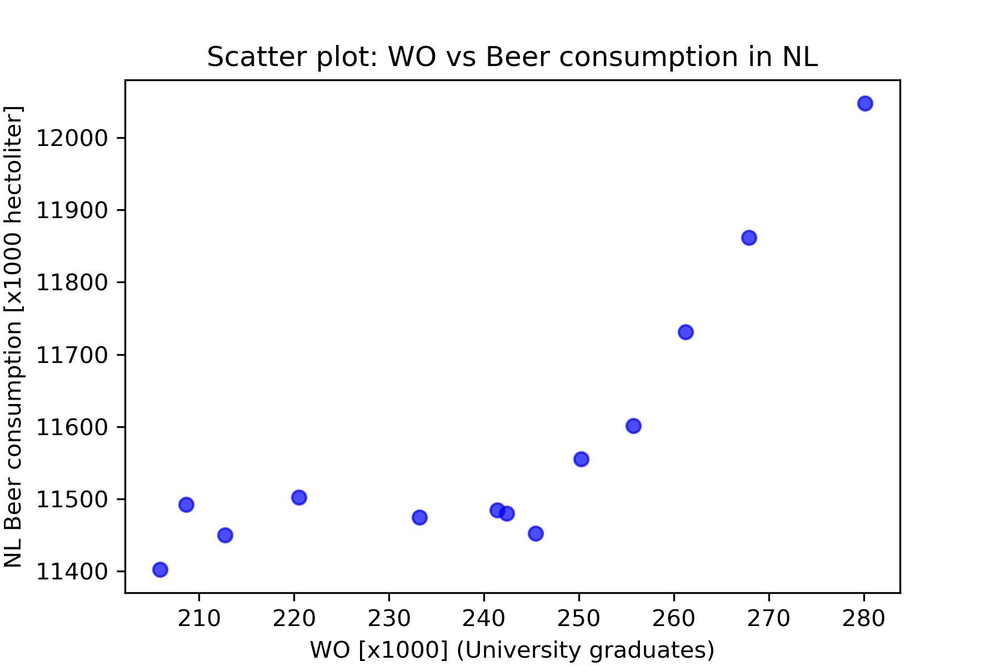

# Solution — Computational Scientist's Toolbox Assignment

**StudentID:** 15988015  
**Name:** Jiawei Li  

## Paper Titles
1. MCC Van Dyke et al., 2019  
2. JT Harvey, Applied Ergonomics, 2002  
3. DW Ziegler et al., 2005  

## Plot from `istherecorrelation.csv`

### Interpretation
- The figure shows the relationship between two variables in the dataset.  
- The fitted line summarizes the linear trend.  
- The correlation coefficient indicates the strength of association.  
- Remember: correlation does not imply causation.  
